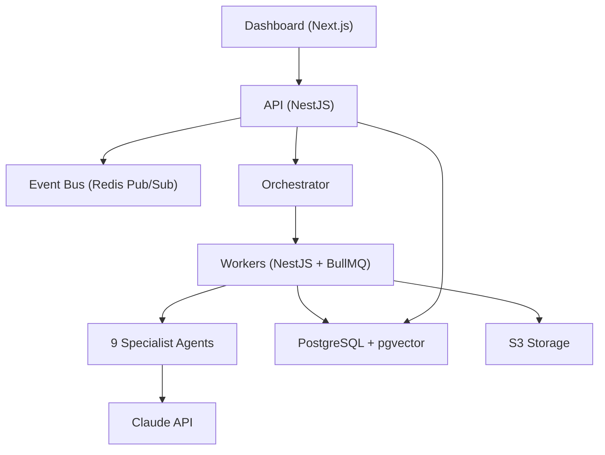

# ARCHITECTURE — Autonomous Web Agency System

## Overview
Dockerized, PostgreSQL-backed, state-driven agent platform.

## Stack
| Layer | Technology |
|---|---|
| Frontend | Next.js 14 (App Router) |
| API | NestJS 10 |
| Workers | NestJS 10 + BullMQ |
| Database | PostgreSQL 16 + pgvector |
| Cache/Queue | Redis 7 |
| Storage | S3-compatible |
| AI | Claude (Anthropic API) |
| Payments | Stripe |
| Email | Resend / SendGrid |
| Monorepo | Turborepo + pnpm |
| Containers | Docker Compose |

## Architecture Diagram

## Agent Architecture
- **Scout**: Lead discovery + scoring
- **Outreach**: Cold email sequences
- **Design Preview**: Website mockup generation
- **Sales Close**: Demo/proposal/invoice handling
- **Web Build**: Website code generation
- **Client Success**: Client communication lifecycle
- **Content**: SEO/marketing content generation
- **Error**: Cross-cutting error handling + retry
- **Code**: Production code generation

## Key Patterns
- State-driven workflows via orchestrator state machine
- Human approval gates at risk points
- Domain events via Redis Pub/Sub
- Per-agent retry policies with exponential backoff
- CAN-SPAM compliance enforced in Outreach Agent
