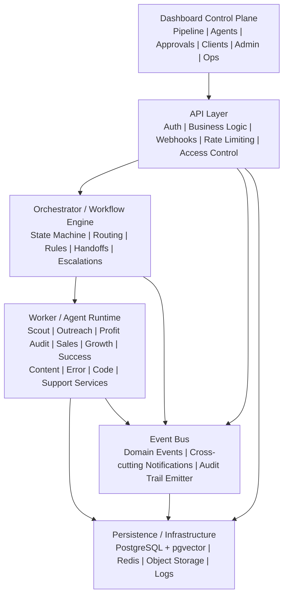

# Merchant Recovery AI (Profit Shield)
## Technical Specification v1.1
### Containerized Multi-Agent Platform for Fee Discovery, Outreach, Profit Auditing, Reinvestment, and Client Operations

Profit Shield AI is a Dockerized, PostgreSQL-backed, state-driven agent platform that identifies businesses overpaying legacy processing fees, audits their "Profit Leak," and automates the transition to "Zero-Fee" processing models.

> [!IMPORTANT]
> **v1.1 Changes from v1:** Added missing data models (AuditLog, ApprovalRequest, Campaign, Notification), expanded LeadStatus with failure/terminal states, added Docker health checks, defined retry/backoff strategy, added event bus layer, worker isolation plan, API rate limiting, and secrets management guidance.

---

## 1. Purpose
This specification defines the first production-ready version of your autonomous web agency system.
The platform must:
- find U.S. service businesses with high processing volume
- audit and score their processing "Profit Leak"
- enrich contact records
- generate and send cold outreach focus on margin retention
- create Profit Recovery Reports (Audits)
- handle replies, activation agreements, and growth plans
- move paid clients into active recovery
- deploy growth assets funded by reclaimed fees
- support client communication and weekly recovery reports
- run inside Docker containers
- use PostgreSQL with vector support
- integrate your existing dashboard as the control plane
- support operational backups, maintenance, incidents, and admin/client access

## 2. System Goals
### Primary goals
- centralize agency operations in one system
- reduce manual lead qualification work
- standardize outreach and fulfillment
- maintain human approval where risk is high
- support scale without losing visibility
- preserve recoverability through backups and maintenance controls

### Non-goals for v1
- full autonomous production deployment without review
- fully automated WhatsApp/Telegram-first support
- fully custom websites without package boundaries
- uncontrolled multi-tenant agency self-service

## 3. Core Principles
### 3.1 State-driven workflows
Every business object must move through explicit states. No silent transitions.

### 3.2 Human review at risk points
Human approval remains mandatory before:
- outreach send
- recovery audit send
- final activation agreement send
- growth plan delivery

All approval actions must be tracked via an `ApprovalRequest` record with reviewer, decision, and timestamps.

### 3.3 Clear separation of concerns
The dashboard is not the orchestrator. The orchestrator is not the worker. The worker is not the API. The agent is not the database.

### 3.4 Recoverability
Every critical asset and database change needs a backup and restore path.

### 3.5 Production discipline
Typed contracts, queue safety, audit logs, structured errors, and repeatable builds are required from the start.

### 3.6 Observability *(NEW)*
All mutation operations must produce an `AuditLog` entry. All services must expose health check endpoints. Rate limiting must be enforced at the API gateway layer.

## 4. High-Level Architecture


> [!NOTE]
> **Event Bus** is a lightweight Redis Pub/Sub layer for domain events (e.g., `lead.status.changed`, `approval.completed`, `agent.run.finished`). It decouples cross-cutting concerns like audit logging, notifications, and analytics from direct agent-to-agent calls.

## 5. System Modules
### 5.1 Dashboard Control Plane
The dashboard is the operator surface. It must provide:
- live pipeline visibility
- agent status visibility
- approval queues
- client/project management
- admin user control
- maintenance controls
- incident review
- backup and restore visibility
- analytics and audit trails
- notification center *(NEW)*

### 5.2 API Layer
The API layer exposes secure endpoints for:
- dashboard reads/writes
- agent-triggered commands
- webhook ingestion
- auth/session handling
- admin/client actions
- reporting queries
- **rate limiting** on all public and webhook endpoints *(NEW)*
- **health check endpoints** for all services *(NEW)*

### 5.3 Orchestrator
The orchestrator is the workflow controller. It must:
- enforce state transitions (including conditional/branching paths)
- assign work to agents/services
- block invalid transitions
- create escalation tasks
- maintain workflow logs
- prevent duplicate actions
- support retries with defined backoff strategy
- emit domain events on state transitions *(NEW)*

### 5.4 Worker Layer
Workers execute background tasks:
- profit audits
- enrichment
- email sequencing
- recovery report generation
- agreement creation
- backup jobs
- maintenance sweeps
- incident classification

> [!IMPORTANT]
> **Worker Isolation:** Heavy workers (Scout/Playwright, Web Build) should run in dedicated queue groups with separate concurrency limits. In production, consider separate worker containers per agent class to prevent resource starvation.

### 5.5 Persistence Layer
Persistence includes:
- relational data in PostgreSQL
- vector embeddings in PostgreSQL via pgvector
- queues/locks/cache in Redis
- media and artifacts in S3-compatible storage

## 6. Monorepo Structure
```bash
/autonomous-web-agency
├── apps
│   ├── dashboard
│   ├── api
│   └── workers
├── packages
│   ├── orchestrator
│   ├── agents
│   ├── services
│   ├── db
│   ├── events            # NEW — domain event bus
│   ├── ui
│   ├── logger
│   ├── types
│   ├── prompts
│   ├── policies
│   ├── config
│   ├── utils
│   └── testing
├── infra
│   ├── docker
│   ├── compose
│   ├── postgres
│   ├── redis
│   ├── nginx
│   ├── monitoring
│   └── scripts
├── backups
│   ├── db
│   ├── dashboard
│   ├── uploads
│   ├── config
│   └── restore
├── docs
│   ├── architecture
│   ├── agents
│   ├── db
│   ├── deployment
│   ├── incidents
│   ├── runbooks
│   └── backups
├── .env.example
├── package.json
├── turbo.json
└── pnpm-workspace.yaml
```

## 7. Application Breakdown
### 7.1 apps/dashboard
This app hosts the UI (Next.js).
**Responsibilities:**
- render pipeline board
- show lead detail pages
- show project/client pages
- render approvals queues
- show agent and system status
- manage admin/client users
- show incidents, maintenance, backups, and analytics
- notification center for alerts and approval requests *(NEW)*

### 7.2 apps/api
This app hosts the backend API (NestJS).
**Responsibilities:**
- auth and sessions
- REST or RPC endpoints
- webhook ingestion with rate limiting
- orchestration entrypoints
- admin/client access control
- data querying and mutation
- system config access
- health check endpoints (`/health`, `/ready`) *(NEW)*

### 7.3 apps/workers
This app hosts background job execution.
**Responsibilities:**
- consume queues (isolated by agent class)
- run agents
- run service jobs
- handle retries with exponential backoff
- run scheduled tasks
- execute backups and maintenance sweeps

## 8. Package Layout
### 8.1 packages/orchestrator
Contains the workflow engine.
### 8.2 packages/agents
Contains visible agent modules (Scout, Outreach, Profit Audit, Sales Close, Growth, Client Success, Content, Error, Code).
### 8.3 packages/services
Contains hidden support services (Recovery Audit, Qualification, Enrichment, Reply Classification, Payment, Backup, Maintenance, Storage, Screenshot, Embedding, Compliance, Notification).
### 8.4 packages/db
Contains Prisma and DB assets.
### 8.5 packages/events *(NEW)*
Contains domain event definitions, emitter, and subscriber infrastructure (backed by Redis Pub/Sub).

## 9. Tech Stack
- **Monorepo:** Turborepo, pnpm
- **Frontend:** Next.js, TypeScript, Tailwind CSS, shadcn/ui, TanStack Query
- **Backend:** NestJS
- **Database:** PostgreSQL + pgvector, Prisma ORM
- **Queues/Cache:** Redis, BullMQ
- **Event Bus:** Redis Pub/Sub *(NEW)*
- **Browser Automation:** Playwright
- **Storage:** S3-compatible
- **Payments:** Stripe
- **Email:** Resend or SendGrid
- **Logging/Error:** Pino, Sentry
- **Containerization:** Docker, Docker Compose

## 10. Database Strategy
Use one PostgreSQL cluster with logical schemas: `core`, `auth`, `ops`, `backup`, `vector`.

---

## 11. Data Models

### 11.1 Auth and Users
*(Unchanged from v1 — User, Session, AdminUser, ClientUser)*

### 11.2 Business and Lead Models
*(Unchanged from v1 — Business, Lead)*

### 11.3 Audit and Contact Models
*(Unchanged from v1 — WebsiteAudit, Contact)*

### 11.4 Outreach, Demo, Conversation
*(Unchanged from v1 — OutreachSequence, DemoAsset, Conversation)*

### 11.5 Sales and Billing
*(Unchanged from v1 — Proposal, Invoice)*

### 11.6 Client and Project Delivery
*(Unchanged from v1 — Client, Project, RevisionRequest)*

> [!WARNING]
> **Re-entry constraint:** `Client.leadId` is `@unique`, meaning a business can only become a client through one lead. If re-engagement is needed, create a new Lead for the same Business. The `Business` model supports multiple leads via `leads Lead[]`.

### 11.7 Content and Operations
*(Unchanged from v1 — ContentAsset, AgentRun, ErrorEvent, Incident, MaintenanceTask, BackupJob, RestoreEvent, EmbeddingRecord)*

### 11.8 NEW Models

#### AuditLog
Tracks all mutation operations for compliance and debugging.
```prisma
model AuditLog {
  id            String   @id @default(cuid())
  actorId       String?
  actorType     ActorType // USER, AGENT, SYSTEM
  action        String   // e.g. "lead.status.changed", "outreach.approved"
  targetType    String?  // e.g. "Lead", "Invoice"
  targetId      String?
  beforeJson    Json?
  afterJson     Json?
  metadata      Json?
  correlationId String?
  ipAddress     String?
  createdAt     DateTime @default(now())

  @@index([targetType, targetId])
  @@index([actorId])
  @@index([createdAt])
}
```

#### ApprovalRequest
Tracks all human approval gates with full decision history.
```prisma
model ApprovalRequest {
  id              String         @id @default(cuid())
  approvalType    ApprovalType   // OUTREACH, PREVIEW, DEMO, INVOICE, DELIVERY
  targetType      String         // e.g. "OutreachSequence", "DemoAsset"
  targetId        String
  leadId          String?
  requestedBy     String?        // agent or system that requested
  reviewedBy      String?        // userId of reviewer
  status          ApprovalStatus // PENDING, APPROVED, REJECTED, EXPIRED
  priority        ApprovalPriority @default(NORMAL)
  notes           String?
  rejectionReason String?
  requestedAt     DateTime       @default(now())
  reviewedAt      DateTime?
  expiresAt       DateTime?

  @@index([status, approvalType])
  @@index([leadId])
}
```

#### Campaign
Manages discovery campaigns for the Scout Agent.
```prisma
model Campaign {
  id           String         @id @default(cuid())
  name         String
  niche        String
  geography    String         // e.g. "Houston, TX" or "Florida"
  sourceConfig Json?          // search engines, directories, etc.
  thresholds   Json?          // min scores, max results, etc.
  status       CampaignStatus // ACTIVE, PAUSED, COMPLETED, ARCHIVED
  leadsFound   Int            @default(0)
  lastRunAt    DateTime?
  createdAt    DateTime       @default(now())
  updatedAt    DateTime       @updatedAt

  @@index([status])
}
```

#### Notification
In-app notification system for operators and clients.
```prisma
model Notification {
  id          String             @id @default(cuid())
  userId      String
  title       String
  body        String?
  channel     NotificationChannel // IN_APP, EMAIL, SLACK
  category    String?             // e.g. "approval", "incident", "agent_failure"
  linkUrl     String?
  isRead      Boolean            @default(false)
  readAt      DateTime?
  createdAt   DateTime           @default(now())

  @@index([userId, isRead])
}
```

---

## 12. Enum Updates

### New Enums *(v1.1)*
```prisma
enum ActorType {
  USER
  AGENT
  SYSTEM
}

enum ApprovalType {
  OUTREACH
  PREVIEW
  DEMO
  INVOICE
  DELIVERY
}

enum ApprovalStatus {
  PENDING
  APPROVED
  REJECTED
  EXPIRED
}

enum ApprovalPriority {
  LOW
  NORMAL
  HIGH
  URGENT
}

enum CampaignStatus {
  ACTIVE
  PAUSED
  COMPLETED
  ARCHIVED
}

enum NotificationChannel {
  IN_APP
  EMAIL
  SLACK
}
```

### Updated LeadStatus *(v1.1)*
Added failure states and terminal success state.
```prisma
enum LeadStatus {
  DISCOVERED
  RESEARCHED
  AUDITED
  QUALIFIED
  DISQUALIFIED          // NEW — failed qualification
  ENRICHED
  ENRICHMENT_FAILED     // NEW — enrichment failure
  OUTREACH_PENDING
  OUTREACH_APPROVED
  OUTREACH_SENT
  OUTREACH_FAILED       // NEW — bounce/delivery failure
  REPLIED
  AUDIT_PENDING
  AUDIT_SENT
  AUDIT_FAILED          // NEW — generation/delivery failure
  AGREEMENT_SENT
  PAID
  RECOVERY_STARTED
  RECOVERY_FAILED       // NEW — activation failure
  REVIEW_PENDING
  DELIVERED
  CLOSED_WON            // NEW — terminal success state
  CLOSED_LOST
  RE_ENGAGE             // NEW — for retry/re-entry later
}
```

*(All other enums from v1 remain unchanged.)*

---

## 13. Workflow State Machine

### 13.1 Lead Pipeline (Updated)

```mermaid
graph LR
    DISCOVERED --> RESEARCHED
    RESEARCHED --> AUDITED
    AUDITED --> QUALIFIED
    AUDITED --> DISQUALIFIED
    QUALIFIED --> ENRICHED
    QUALIFIED --> ENRICHMENT_FAILED
    ENRICHMENT_FAILED --> ENRICHED
    ENRICHED --> OUTREACH_PENDING
    OUTREACH_PENDING --> OUTREACH_APPROVED
    OUTREACH_APPROVED --> OUTREACH_SENT
    OUTREACH_SENT --> OUTREACH_FAILED
    OUTREACH_SENT --> REPLIED
    OUTREACH_FAILED --> OUTREACH_PENDING
    REPLIED --> DEMO_PENDING
    DEMO_PENDING --> DEMO_SENT
    DEMO_PENDING --> DEMO_FAILED
    DEMO_FAILED --> DEMO_PENDING
    DEMO_SENT --> PROPOSAL_SENT
    PROPOSAL_SENT --> INVOICE_SENT
    INVOICE_SENT --> PAID
    PAID --> BUILD_STARTED
    BUILD_STARTED --> BUILD_FAILED
    BUILD_FAILED --> BUILD_STARTED
    BUILD_STARTED --> REVIEW_PENDING
    REVIEW_PENDING --> DELIVERED
    DELIVERED --> CLOSED_WON
    DISQUALIFIED --> RE_ENGAGE
    CLOSED_LOST --> RE_ENGAGE
    RE_ENGAGE --> DISCOVERED
```


### 13.2 Conditional Transitions *(NEW)*
The orchestrator must support:
- **Skip paths:** Warm referrals can enter at `OUTREACH_PENDING` or `DEMO_PENDING` directly
- **Re-entry:** `CLOSED_LOST` and `DISQUALIFIED` can move to `RE_ENGAGE` → `DISCOVERED` for retry
- **Failure recovery:** Failed states can retry to their preceding state (e.g., `OUTREACH_FAILED` → `OUTREACH_PENDING`)

### 13.3 Invalid Transitions
The orchestrator must reject all transitions not in the graph above. Examples:
- `DISCOVERED → PAID` is invalid
- `OUTREACH_SENT → DELIVERED` is invalid
- `PAID → OUTREACH_PENDING` is invalid

---

## 14. Retry and Backoff Strategy *(NEW)*

All retryable operations must follow a consistent strategy:

| Concern | Default |
|---|---|
| Max retries | 3 (agents), 5 (services) |
| Backoff | Exponential: `min(2^attempt * 1000ms, 60000ms)` |
| Jitter | ±20% random jitter |
| Dead-letter queue | After max retries, move to DLQ for manual review |
| DLQ review | Surface in Dashboard → Maintenance section |
| Idempotency | All agent tasks must be idempotent or check for prior completion |

Per-agent overrides:
| Agent/Service | Max Retries | Notes |
|---|---|---|
| Scout (Playwright) | 2 | Resource-heavy, fail fast |
| Outreach send | 1 | No silent re-sends; route to approval |
| Payment webhook | 5 | Critical path, higher tolerance |
| Backup job | 3 | Must alert on final failure |
| Preview generation | 2 | Timeout-prone |

---

## 15. Docker Compose (Updated)

### 15.1 Health Checks *(NEW)*
All services must define health checks:

```yaml
services:
  dashboard:
    build:
      context: .
      dockerfile: infra/docker/dashboard.Dockerfile
    env_file: .env
    depends_on:
      api:
        condition: service_healthy
    healthcheck:
      test: ["CMD", "curl", "-f", "http://localhost:3000/api/health"]
      interval: 30s
      timeout: 10s
      retries: 3
      start_period: 40s

  api:
    build:
      context: .
      dockerfile: infra/docker/api.Dockerfile
    env_file: .env
    depends_on:
      postgres:
        condition: service_healthy
      redis:
        condition: service_healthy
    healthcheck:
      test: ["CMD", "curl", "-f", "http://localhost:4000/health"]
      interval: 15s
      timeout: 5s
      retries: 3
      start_period: 30s

  workers:
    build:
      context: .
      dockerfile: infra/docker/workers.Dockerfile
    env_file: .env
    depends_on:
      postgres:
        condition: service_healthy
      redis:
        condition: service_healthy
      api:
        condition: service_healthy
    healthcheck:
      test: ["CMD", "curl", "-f", "http://localhost:4001/health"]
      interval: 30s
      timeout: 10s
      retries: 3
      start_period: 30s

  postgres:
    image: pgvector/pgvector:pg16
    environment:
      POSTGRES_DB: agency
      POSTGRES_USER: agency
      POSTGRES_PASSWORD: agency
    volumes:
      - postgres_data:/var/lib/postgresql/data
      - ./infra/postgres/init:/docker-entrypoint-initdb.d
    healthcheck:
      test: ["CMD-SHELL", "pg_isready -U agency -d agency"]
      interval: 10s
      timeout: 5s
      retries: 5
      start_period: 20s

  redis:
    image: redis:7-alpine
    volumes:
      - redis_data:/data
    healthcheck:
      test: ["CMD", "redis-cli", "ping"]
      interval: 10s
      timeout: 5s
      retries: 5

  nginx:
    build:
      context: .
      dockerfile: infra/docker/nginx.Dockerfile
    depends_on:
      dashboard:
        condition: service_healthy
      api:
        condition: service_healthy

  backup-runner:
    build:
      context: .
      dockerfile: infra/docker/backup-runner.Dockerfile  # CHANGED — dedicated Dockerfile
    command: ["pnpm", "backup:run"]
    env_file: .env
    depends_on:
      postgres:
        condition: service_healthy

volumes:
  postgres_data:
  redis_data:
```

> [!NOTE]
> **backup-runner now uses its own Dockerfile** (`backup-runner.Dockerfile`) instead of sharing the API Dockerfile. This reduces image size and attack surface.

---

## 16. API Rate Limiting *(NEW)*

Apply rate limiting at the nginx and NestJS levels:

| Endpoint Class | Rate Limit | Window |
|---|---|---|
| Webhook ingestion | 100 req | 1 minute |
| Auth endpoints | 10 req | 1 minute |
| Dashboard API (authenticated) | 300 req | 1 minute |
| Agent-triggered commands | 60 req | 1 minute |
| Public endpoints | 30 req | 1 minute |

Use `@nestjs/throttler` for application-level enforcement. Use nginx `limit_req` for edge enforcement.

---

## 17. Secrets Management *(NEW)*

### v1 (Development / Staging)
- `.env` files (gitignored)
- `.env.example` checked into version control
- No secrets in Docker images

### v1 Production Hardening
- Use Docker Secrets for sensitive values (DB passwords, API keys, Stripe keys)
- Environment variables injected at runtime, never baked into images
- Consider HashiCorp Vault or cloud KMS for key rotation in later phases

---

## 18. Agent Contracts
*(Unchanged from v1 — base contract, all 9 agent definitions with inputs/outputs/failure conditions.)*

## 19. Support Services
*(Unchanged from v1 — 12 support services.)*

## 20. Dashboard Section Map
*(Unchanged from v1, with the addition of Notification Center in the sidebar.)*

### 20.11 Notifications *(NEW)*
Shows:
- unread approval requests
- agent failure alerts
- incident alerts
- system maintenance notices
- filterable by category and read status

## 21. Backup Plan
*(Unchanged from v1.)*

## 22. Development Backup Plan
*(Unchanged from v1.)*

## 23. Maintenance Plan
*(Unchanged from v1.)*

## 24. Error Handling Standards
*(Unchanged from v1.)*

## 25. Code Quality Standards
*(Unchanged from v1.)*

## 26. Security and Access Control
*(Unchanged from v1.)*

## 27. Vector Use Cases
*(Unchanged from v1.)*

## 28. Antigravity Integration
*(Unchanged from v1.)*

## 29. Suggested Runbooks
*(Unchanged from v1.)*

---

## 30. Implementation Roadmap (Updated)

| Phase | Focus | Key Deliverables |
|---|---|---|
| **Phase 1** | Foundation | Monorepo, Docker w/ health checks, PostgreSQL + pgvector, Redis, Auth, Prisma schema (all models incl. new), Orchestrator skeleton, Event bus, Pipeline UI |
| **Phase 2** | Discovery | Scout Agent, Campaign management, Audit Service, Qualification Service, Enrichment Service, Approvals queue |
| **Phase 3** | Outreach | Outreach Agent, Inbound reply path, Reply Classification, Conversation logging, Analytics basics, Notification service |
| **Phase 4** | Sales | Design Preview Agent, Storage pipeline, Review flow, Proposal/Invoice flow, Stripe webhook |
| **Phase 5** | Fulfillment | Web Build Agent, Client Success Agent, Project/Revision modules, Client users and access |
| **Phase 6** | Content & Ops | Content Agent, Error Agent, Code Agent, Incident center, Maintenance center |
| **Phase 7** | Reliability | Backup runner (dedicated container), Restore tooling, Verification jobs, Disaster recovery tests, Audit log review UI |

---

## 31. Minimum Viable Production Readiness Checklist (Updated)

### Infrastructure
- [ ] Docker services build successfully with health checks passing
- [ ] PostgreSQL has pgvector enabled
- [ ] Redis queue works
- [ ] Storage bucket works
- [ ] Webhooks reachable
- [ ] Backups run and verify
- [ ] Rate limiting enforced on all public endpoints
- [ ] Secrets not baked into images

### Software
- [ ] Auth works
- [ ] Admin/client roles enforced
- [ ] Orchestrator blocks invalid state transitions
- [ ] Agent run logs recorded
- [ ] Errors produce structured events
- [ ] Incident creation works
- [ ] AuditLog entries created for all mutations
- [ ] ApprovalRequest workflow end-to-end functional
- [ ] Notifications delivered for approval and incident events
- [ ] Retry/DLQ strategy verified

### Business flow
- [ ] Lead enters pipeline via Campaign
- [ ] Audit generated
- [ ] Outreach approval request created and resolved
- [ ] Outreach sent
- [ ] Reply logged and classified
- [ ] Proposal and invoice created
- [ ] Paid lead becomes client/project
- [ ] Project moves to delivery
- [ ] Lead marked CLOSED_WON
- [ ] Client sees correct state
